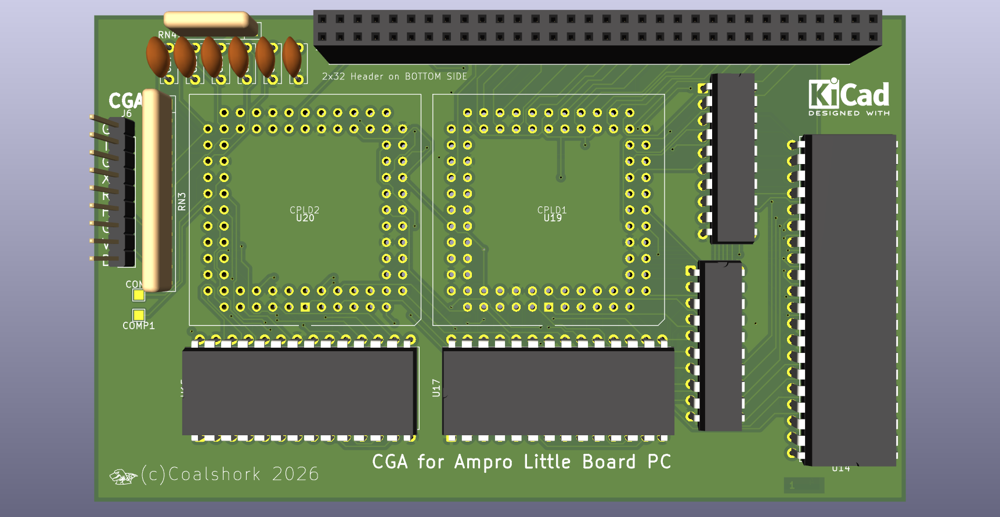

# AmproCGA
A CGA card for the Ampro Little Board PC. Takes CPLDs from a generic Chinese CGA card for compactness.

The CPLDs used in this are from [this card.](https://8086cpu.com/lm6/79.html) 
If you intend to build one you will need to purchase that card from eBay or something and transfer the ICs to my board.
As of writing this, the board has not been tested, do not expect it to work first try. I expect there will be some hiccups.
